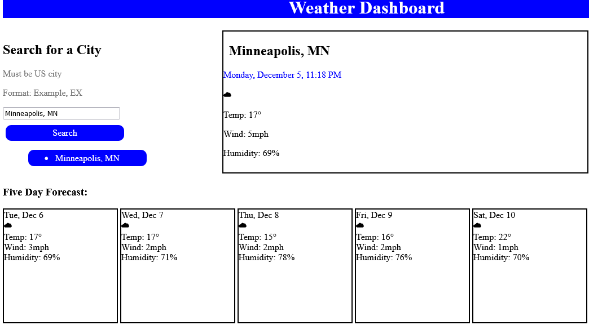

# Weather Dashboard

## Description

This app allows the user to search for current weather in a given US city, and will also display the five day forecast for that city. This is a convenient way to quickly check the basic weather stats of a city, including temperature, wind, and humidity.

## Table of Contents

N/A

## Installation

N/A

## Usage

Enter any US city name in the search bar, followed by a comma and the two-letter state code, then click 'Search'. The current weather for the city will be displayed in the center of the screen, and the five day forecast will be displayed below.

## Credits

UofM WebDev Bootcamp

## License

MIT